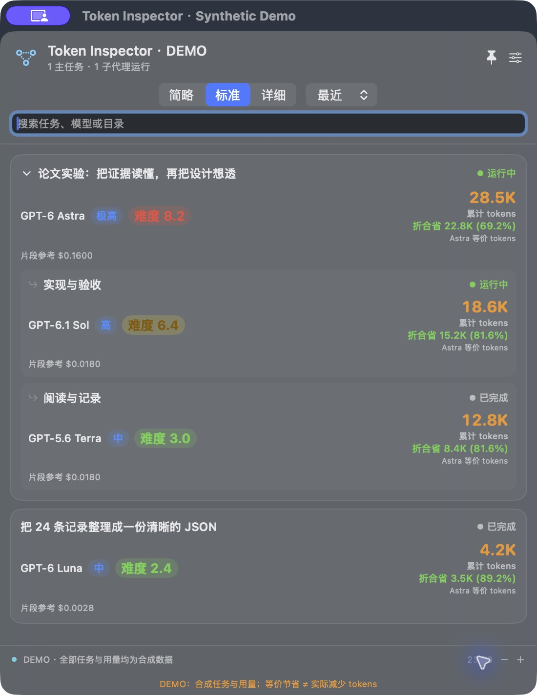
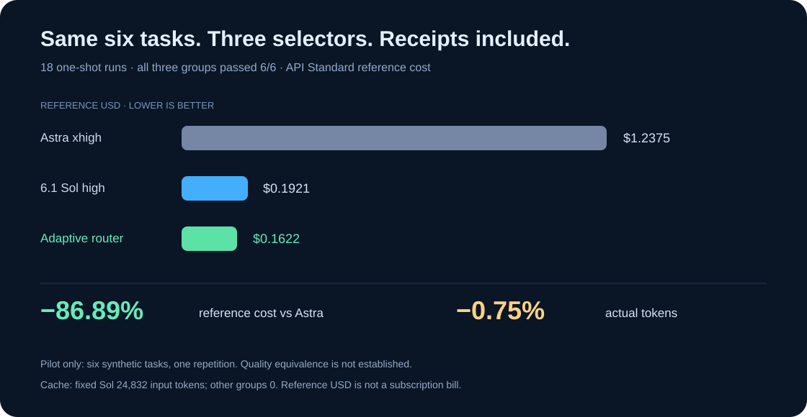

# Agent Smith · 史密斯专员

**Token overspending? Better Call Smith.**<br>
*The most expensive model need not appear in every court hearing.*

[](https://github.com/Chengjun023/agent-smith/actions/workflows/ci.yml)


[完整中文说明](README.zh-CN.md) · [Architecture](docs/architecture.md) · [Engineering notes](docs/engineering.md) · [Roadmap](docs/roadmap.md)

Still calling your most expensive model to fix a comma? Agent Smith takes the case.

Built by Chengjun, Agent Smith pairs a local Codex model router with a native floating usage monitor and reproducible benchmarks. Routine work gets a lighter model; difficult cases bring in the heavy hitters. Every claim comes with receipts.

Two components live here:

| Component | Current version | Job |
| --- | --- | --- |
| [Adaptive Router](router/README.md) | 0.3.0 | Local model selection, preferences, evidence-backed acceptance, and reproducible benchmarks |
| [Codex Float](float/README.md) | 0.5.0 | A native macOS floating window for local Codex tasks, agents, usage, and reference costs |

This is an independent personal project. The logo-head lawyer ad is an AI-generated Better Call Saul parody; [artwork and source credits](THIRD_PARTY_NOTICES.md).

## See the bill of materials

<p align="center"></p>

*A native Float demonstration using synthetic task names and usage data; these rows are illustrative.*

Float keeps the useful bits in view: blue reasoning effort, green/yellow/red difficulty, orange token counts, and green Astra-equivalent savings. Resize the glass window, adjust transparency and text size, and switch between current-turn and cumulative usage. Expand a task to inspect its child agents and routing evidence.

The official Codex databases are opened read-only. Float writes its own numeric SQLite ledger, including thread/request IDs and read checkpoints, to deduplicate usage across restarts and log rotation. Conversation bodies and reasoning text stay out of that ledger. Missing usage or prices stay unknown; each metered request keeps its original price snapshot.

## Objection: the router has receipts

Difficulty is a local, uncalibrated 1.0–10.0 heuristic in 0.1 steps. Scoring, metering, and price comparisons add no model calls. Two optional preference questions cover your priority—quality, balance, cost, or speed—and your usual work.

The router can discover new entries from models.dev on a TTL, keep a last-good snapshot, and admit candidates using local price, capability, endpoint, and host evidence. Discovery does not grant execution access. Execution currently uses Codex; other providers are catalog metadata.

An enabled task routes independent work blocks through native subagents. A skill cannot switch the main task's model halfway through its generation. Dispatch and acceptance are separate: `accepted`, `rejected`, and `unknown` have explicit evidence semantics. Benchmark feedback stays outside production learning.

## The pilot: small enough to cross-examine

Six public synthetic tasks × three strategies × one attempt: **18/18 passed** the deterministic graders.

| Strategy | Accepted | Actual tokens | API Standard reference USD |
| --- | ---: | ---: | ---: |
| Fixed Astra | 6/6 | 102,162 | $1.237460 |
| Fixed 6.1 Sol | 6/6 | 105,285 | $0.1921092 |
| Local router | 6/6 | 101,392 | $0.1621807 |



Against fixed Astra, the router used **86.89% less reference cost** and **0.75% fewer actual tokens** in this pilot. Fixed 6.1 Sol had 24,832 cached input tokens; the other groups had zero. Cache exposure matters when reading the cost comparison.

All six tasks passed in each group. This one-shot selector experiment measures that task set; broader quality equivalence and the benefits of multi-agent coordination, retries, or failure escalation need separate experiments. USD values multiply measured usage by frozen API Standard reference prices; they are not Codex subscription bills.

[Public results and reproduction files](router/benchmarks/results/pilot-public/) · [Benchmark protocol](router/benchmarks/README.md)

## Try it locally

The Python parts use the standard library. Router execution uses an existing Codex login. Float requires macOS 14+, `/usr/bin/python3`, and Xcode Command Line Tools.

From the cloned repository root, register the local marketplace and install the router:

```sh
codex plugin marketplace add .
codex plugin add adaptive-router@agent-smith
```

Inspect the router without invoking a model:

```sh
python3 router/scripts/router.py --help
python3 router/scripts/model_registry.py show
```

Enable it in a new Codex task with:

```text
Use $adaptive-route for this task: …
```

See the [router guide](router/README.md) for modes, preferences, and explicit model pins.

Build and open Float:

```sh
cd float
sh scripts/build.sh
open "build/Codex Float.app"
```

The build uses an ad-hoc signature. Distribution is source-first; there is no prebuilt DMG.

For the screenshot's synthetic demo, run `sh scripts/build.sh --demo` from `float/` and open the legacy-named `build/Token Inspector Demo.app`. Its existing separate app identity and fixtures keep demo preferences stable and the demo away from live task readers.

From the repository root, run the regression suites or an offline benchmark demonstration:

```sh
python3 -m unittest discover -s router/tests -q
python3 -m unittest discover -s float/tests -q
python3 router/benchmarks/benchmark.py demo --run-dir /tmp/agent-smith-demo
python3 router/benchmarks/benchmark.py report --run-dir /tmp/agent-smith-demo --output /tmp/agent-smith-demo-report
```

Use fresh output directories. `demo` uses synthetic answers and usage; `replay` regrades recorded artifacts. Neither calls a model. The imported baseline has **130 router tests and 50 Float tests**; current commands are the source of truth as coverage evolves.

## The choices worth discussing

I chose explicit unknowns over convenient zeros, frozen historical prices over retroactive repricing, and deterministic grading over treating a clean process exit as success. The routing heuristic is readable enough to argue with, and the pilot is small enough to inspect.

Where should a rule-based difficulty score give way to measured workload evidence? How many accepted examples justify changing a local preference? How should cost comparisons expose cache effects and partial usage coverage? Those are the questions I'd like this project to make concrete.

[Contribute](CONTRIBUTING.md) · [MIT license](LICENSE)
