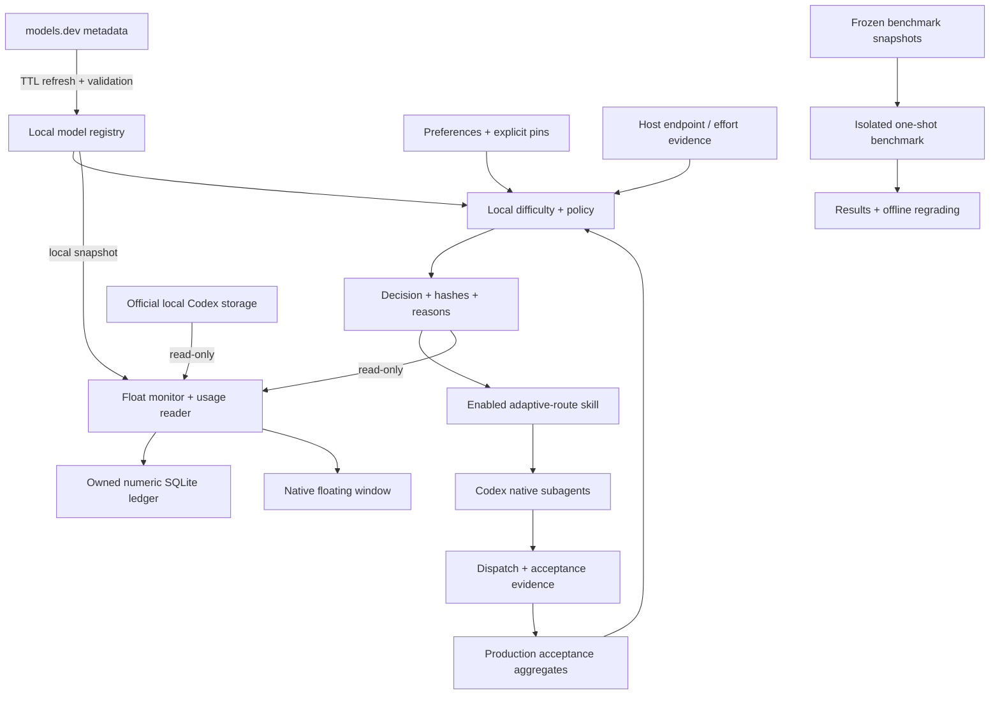

# Architecture

Token Inspector separates selection, execution evidence, observation, and accounting. The router owns decisions; Codex executes authorized work; Float observes local records and owns its numeric ledger.

## Router: policy with provenance

[`difficulty.py`](../router/scripts/difficulty.py) extracts local task features and returns a 1.0–10.0 score in 0.1 increments. This is an uncalibrated workload heuristic; qualitative confidence labels are not probabilities. Scoring adds no inference request.

[`model_registry.py`](../router/scripts/model_registry.py) separates provider/model identity from execution endpoints. The normal proposal CLI can refresh models.dev metadata on a 24-hour TTL, with a 15-minute failure cooldown and a last-good fallback. Bounded input validation, content hashes, atomic cache replacement, and immutable snapshots preserve provenance. Public metadata creates candidates; local admission records capability and endpoint evidence, and host admission separately records executable model/effort support. The current execution path is Codex. Other providers are represented in the catalog.

[`policy.py`](../router/scripts/policy.py) and [`router.py`](../router/scripts/router.py) combine task type, score, risk, failure count, preferences, explicit pins, registry capability, and host support. Eligible candidates must meet the workload's capability floor. High-risk and repeated-failure paths have a stronger gate; unavailable required configurations fail explicitly. Unknown capability does not satisfy a constraint. Specific user pins have priority and still undergo availability checks.

The optional two-question preference flow records priority and workload. `auto` selects a block, `ask` freezes a recommendation and starts its timer after the question is shown, and `preset` selects a fixed phase combination. A timeout resolves routing preference inside the active task; business actions retain their own authorization.

## Execution and acceptance

The [`adaptive-route` skill](../router/skills/adaptive-route/SKILL.md) routes independently checkable blocks through native subagents. It cannot switch the main task's model midway through its current generation. Work without a useful independent split stays with the main task.

Router state resides in `~/.codex/adaptive-router/state.sqlite3`. Dispatch records need execution IDs or equivalent structured evidence. Acceptance is an immutable outcome per decision: `accepted` needs a verification source, `rejected` needs a failure classification, and `unknown` records an unresolved judgment. A successful dispatch or process exit does not establish quality acceptance.

Local feedback aggregates by workload cohort and actual model/effort. At least five explicit accepted/rejected examples are required before bounded ranking adjustments apply. Benchmark scope and `--no-learning` decisions are excluded. Detailed decisions expire after seven days on subsequent decision creation; anonymous aggregates and idempotency receipts persist. Task text and hidden reasoning are excluded from persisted router metadata.

## Float: observation with an owned ledger

[`monitor.py`](../float/backend/monitor.py) opens official `state_5.sqlite`, `thread_history_1.sqlite`, and available desktop title metadata using read-only connections and `query_only`. It reads bounded event segments for older task formats. Float observes local Codex tasks and their parent/child relationships; remote hosts and ordinary ChatGPT chats are outside the adapter's current scope.

[`meter.py`](../float/backend/meter.py) interprets request usage. [`usage_ledger.py`](../float/backend/usage_ledger.py) stores deduplicated numeric records in `~/.codex/adaptive-router/usage.sqlite3`: thread/request/turn IDs, model, token fields, costs, price hash, observation time, and read checkpoints. Persisted identity supports restart and rotation recovery. The ledger excludes conversation, reasoning, and tool bodies. A task brief can participate in local in-memory difficulty fallback; it stays out of monitoring output and saved ledger records.

Prices come from the shared local registry with a bundled fallback. Float checks local changes every minute and performs no network refresh itself. Once recorded, a request's price stays frozen. Missing usage or required prices produce unknown/partial coverage. The window exposes current-turn and cumulative usage, reference cost, equivalent savings, model settings, difficulty, routing reasons, and acceptance status.

[`CodexFloat.swift`](../float/app/CodexFloat.swift) supplies the SwiftUI/AppKit floating window and launches the Python monitor. The display refreshes about every two seconds. Glass opacity, window dimensions, text scaling, and filters are saved in macOS UserDefaults. Closing hides the window; quitting ends its monitor without changing Codex task execution.

Shared Python definitions are vendored into Float by [`sync_router.py`](../float/scripts/sync_router.py), with hashes recorded in `float/data/router-vendor.json`, so a standalone build carries known scoring and registry code.

## Benchmark: a frozen experiment

The [harness](../router/benchmarks/README.md) freezes task prompts, fixtures, selector choices, model/catalog evidence, price snapshot, seed, graders, and code hashes. Live execution reuses those choices. Workspaces contain public fixtures; answers and graders stay outside the model workspace. Every job has separate artifacts and immutable results.

The pilot compares one request per task under fixed Astra, fixed 6.1 Sol, and the local selector. It isolates selector behavior. Offline replay changes the grading record in a new output file while preserving the original result. Simulated runs are labeled separately, and benchmark feedback never enters production learning.

See [engineering notes](engineering.md) for accounting definitions and failure semantics.
